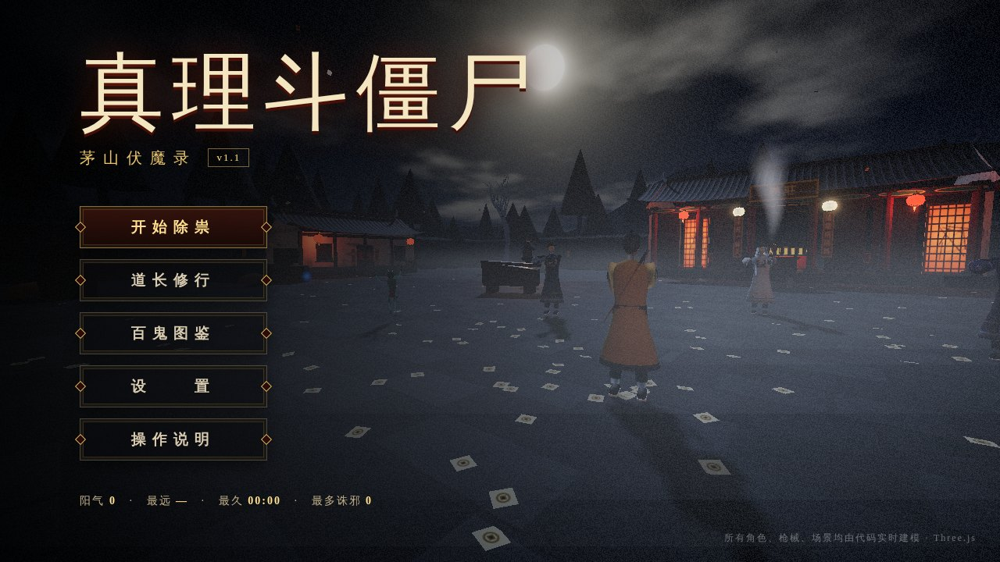
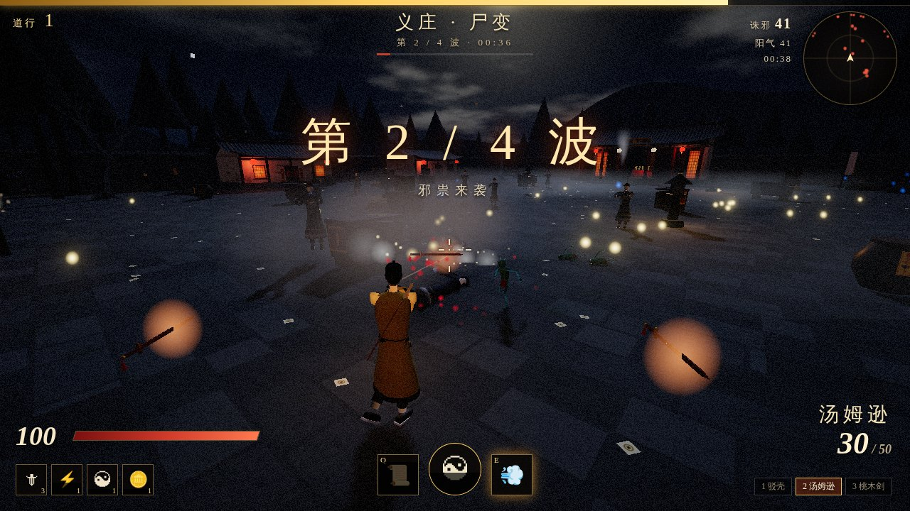
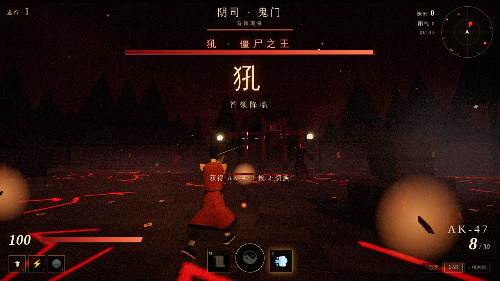
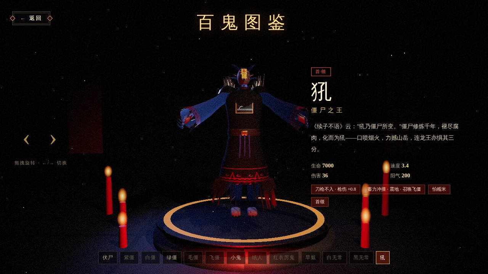
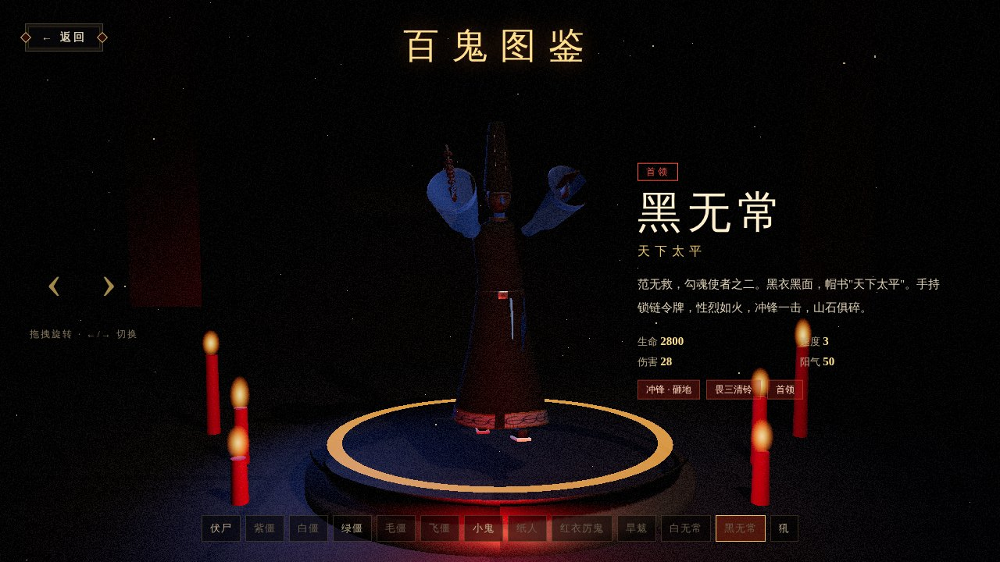

# 真理斗僵尸 · 茅山伏魔录（v1.1）

基于 **Three.js** 的中国志怪题材 **Roguelite 射击游戏**。你是茅山道长，手持驳壳枪与桃木剑，
在义庄、荒村、阴司三大章节中迎战源源不绝的僵尸与鬼怪——杀敌吸取阳气、道行精进时择一
**茅山道术** 修习，击败首领后择一件 **法宝**，一路打到僵尸之王 **犼**，再进入 **无尽轮回**。

> v1.1 起，**所有角色、枪械、场景均由代码实时建模**，不再依赖任何外部 3D 模型文件。
> 骨骼与蒙皮权重由程序生成，动作不再出现错位、拉伸。







## 运行

```bash
npm install
npm run dev        # 开发：http://localhost:5173（或 5208，见 .claude/launch.json）
npm run build      # 打包到 dist/
```

## 玩法

- **章节战役**：每章若干限时波次持续刷怪（越往后越密集），最后首领登场；击败首领即过关。
  1. **义庄 · 尸变** —— 伏尸 / 紫僵 / 白僵 / 小鬼 → 首领 **旱魃**（灼烧光环、火环弹幕）
  2. **荒村 · 纸扎** —— 纸人 / 红衣厉鬼 / 绿僵 → 首领 **黑白无常**（勾魂索、召唤小鬼 / 冲锋、砸地）
  3. **阴司 · 鬼门** —— 毛僵 / 飞僵 / 小鬼潮 → 首领 **犼**（蓄力冲撞、震地、召唤飞僵、狂暴）
  - 通关后可选择 **无尽轮回**：怪物持续加强，每三轮轮换首领。
- **道行升级**：诛邪掉落阳气珠，吸取后升级，从 3 张卡中择一（可重掷 / 跳过）：
  - **道术**（自动施放）：五雷正法、桃木剑阵、铜钱剑、八卦镜、糯米阵、墨斗线、三清铃、纸人替身、七星剑诀
  - **修身**（被动）：金刚护体、净心神咒、神行符、聚阳诀、黑狗血弹、连环手、朱砂弹头、天眼通、道心坚定、掐诀如飞、吸阳术、金光咒、铁布衫、悟道、火符精进、火符连珠、三昧真火
  - **兵器**：汤姆逊冲锋枪、AK-47、双管猎枪、加特林，以及各兵器改良
  - **进阶道法**（道术满级 + 条件修身）：九天应元雷、万剑归宗、太极两仪镜、天罗地网
- **法宝**（过关奖励）：茅山祖师令、天师印、七星续命灯、黑狗血葫芦、八卦道袍、乾坤袋、引魂幡、五帝钱
- **精英怪** 掉落镇尸宝箱（额外一次选卡）；偶有回春葫芦回血。
- **局外修行**：每局结算阳气，可永久强化生命、移速、枪伤、火符、悟性、福缘。
- **百鬼图鉴**：13 种怪物在灵堂供台上展示专属动作，可拖拽旋转，附传说设定与特性。

## 操作

| 按键 | 功能 |
| --- | --- |
| W A S D / Shift / 空格 | 移动 / 疾跑 / 跳跃 |
| 鼠标左键 | 射击 / 挥桃木剑 |
| 右键 / Q | 掷火符（抛物线，爆出真火 AOE） |
| E | 罡步冲刺（无敌帧） |
| F | 天师降魔（击杀蓄满后天雷劈遍全场） |
| 1~6 / 滚轮 · R | 切换已获得武器 · 换弹 |
| V | 切换第一 / 第三人称 |
| Esc | 暂停（可调音量、灵敏度、画质、视角） |

## 技术要点

- **程序化角色**（`src/gfx/characters.js` + `src/gfx/rig.js`）
  - 骨骼由代码定义，绑定姿态下骨骼无旋转；网格部件（放样管、椭圆车削、弯曲布条、爪、辫子……）
    在模型空间搭建，按「刚性 / 关节平滑过渡链 / 自定义函数」三种方式自动写入蒙皮权重——权重永远正确。
  - 参照 v1.0 的模型造型：清代官服、胸前补子（仙鹤/日纹）、海水江崖袍摆、暖帽顶珠、额贴符纸、长辫、利爪；
    犼有鬼角、骨刺鬃毛、兽足；黑白无常有高帽「一见生财 / 天下太平」、长舌、哭丧棒、锁链令牌。
  - 所有贴图（脸谱、符纸、补子、纹样、帽文）由 Canvas 实时绘制成一张图集。
  - 自定义「超级材质」：顶点属性携带粗糙度 / 金属度 / 自发光 / 纹样强度，每个角色仅 2 个 draw call。
- **程序化动画**（`src/gfx/anim.js`）：僵尸蹦跳与三段爪击、小鬼疾奔、纸人抽搐碎步、厉鬼漂浮施法、
  无常甩链与砸地、犼的蓄力冲撞 / 震地 / 咆哮、道长持枪瞄准 / 挥剑 / 掐诀 / 阵亡，以及各类死亡动作。
- **程序化枪械**（`src/gfx/guns.js`）：侧视轮廓挤出 + 倒角、车削枪管、散热片、弹鼓、准星照门、扳机护圈、
  木纹法线贴图；第一人称带道袍袖与手，第三人称枪械挂在道长手骨上。
- **程序化场景**（`src/world.js`）：带起翘的曲面屋顶与鸱吻、义庄大殿（灵台牌位、停棺、楹联）、牌坊、
  民居、坟地招魂幡、香炉青烟、枯树、竹林（第二章）、余烬与地裂熔光（第三章）、云月星空着色器、地雾、鬼火、飘落纸钱。
- **后期**：Bloom 泛光 + 暗角 / 胶片颗粒 / 受伤红晕 / 阵亡褪色。
- **性能**：GPU 点粒子（单 draw call）、敌人对象池、固定数量的灯光池、InstancedMesh 场景件。
- WebAudio 合成音效与五声音阶背景音乐，无外部音频资源。

## 目录结构

```
index.html            全部界面（加载 / 主菜单 / 剧情 / 修行 / 设置 / 图鉴 / HUD / 选卡 / 暂停 / 结算）
src/main.js           状态机与主循环
src/data.js           怪物图鉴 · 章节波次 · 局外修行
src/director.js       章节导演（波次、首领、无尽轮回）
src/enemies.js        敌人 AI / 命中体 / 状态效果 / 弹幕 / 首领技能
src/skills.js         茅山道术、修身、进阶、法宝、火符、天师降魔
src/weapons.js        武器系统（第一人称视图模型、射击、换弹、挥剑）
src/priest.js         道长第三人称化身
src/player.js         控制器（移动 / 跳 / 冲刺）
src/pickups.js        阳气珠 / 回春葫芦 / 宝箱
src/effects.js        GPU 粒子与特效
src/postfx.js         后期处理
src/hud.js            HUD（雷达、伤害飘字、首领血条……）
src/codex.js          百鬼图鉴
src/world.js          场景与章节氛围
src/gfx/              程序化建模：textures / rig / shapes / characters / anim / guns
tools/                开发用预览页（角色画廊、枪械、姿势）
```
